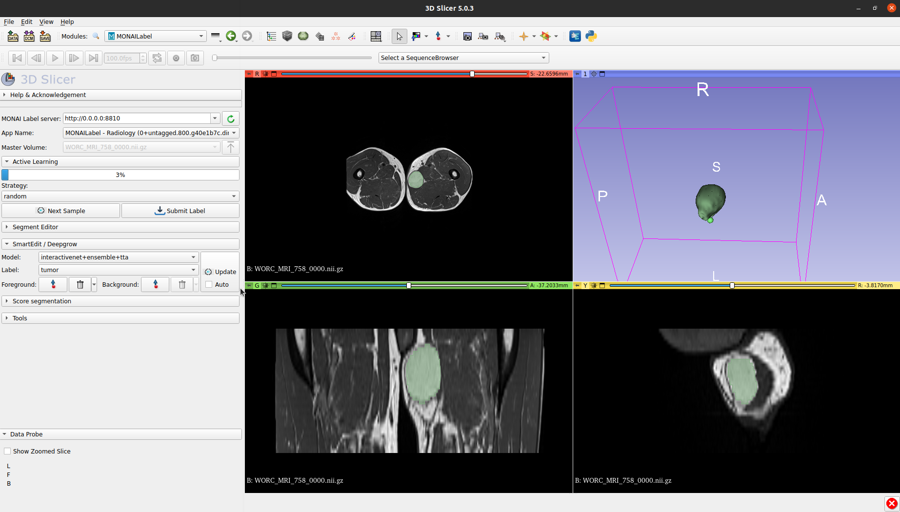

# InteractiveNet

 PyPi                          |Citing InteractiveNet          |
-------------------------------|---------------------|
[![][pypi]][pypi-lnk]         | [![][DOI]][DOI-lnk] |

[pypi]: https://badge.fury.io/py/interactivenet.svg
[pypi-lnk]: https://badge.fury.io/py/interactivenet

[DOI]: https://zenodo.org/badge/469761094.svg
[DOI-lnk]: https://zenodo.org/badge/latestdoi/469761094

Automatic segmentation has success in a variety of application throughout medical imaging. However, there could be a couple of reasons for automatic segmentation to fall short of providing accurate segmentations:
- Object are irregular and/or lobulated, which creates difficult segmentation task.
- It is impossible to encompass all heterogeneity from the patient population in a training dataset.
- It is difficult to create a (large) annotated dataset.

Here, we address this issue by using knowledge from a trained clinician to guide a 3D U-Net to improve segmentations. This is done using six interior margin points, i.e. extreme point in each axis. In theory, this approach should provide accurate segmentations for object or on modalities not seen during the training of the model. Currently, this has been assessed in various types of Soft-Tissue Tumors.

Inspired by [nnU-Net](https://github.com/MIC-DKFZ/nnUNet), InteractiveNet uses dataset properties like imaging modality, voxel spacing, and image size to determine the best possible configuration for preprocessing, training, postprocessing, ensembling, and much more to provide a miminally interactive segmenation pipeline. By providing this framework, we hope to enable the use of minimally interactive segmentation for many more applications in medical imaging. **We provide the option to generate interior margin points [synthetically](documentation/synthetic_interactions.md) from ground truth segmentation**, which is ideal for pilot studies.

# Table of Contents
- [InteractiveNet](#interactivenet)
- [Table of Contents](#table-of-contents)
- [Installation](#installation)
- [Usage](#usage)
    - [Running on a new dataset](#Running-on-a-new-dataset)
    - [Fingerprinting and preprocessing](#Fingerprinting-and-preprocessing)
    - [MLflow](#MLflow)
    - [Training](#Training)
    - [Testing](#Testing)
    - [Inference](#Inference)
- [Deploy](#Deploy)
- [Pretrained model](#Pretrained-model)
- [Graphical User Interface](#Graphical-User-Interface)

## License
This package is covered by the open source [APACHE 2.0 License](LICENSE.md).

When using InteractiveNet, please cite the paper describing InteractiveNet as as follows:

```bibtex
@article{spaanderman2023softtissuesegmentation,
   title={Minimally Interactive Segmentation of Soft-Tissue Tumors on CT and MRI using Deep Learning}, 
   author={Douwe J. Spaanderman, Martijn P. A. Starmans, Gonnie C. M. van Erp, David F. Hanff, Judith Sluijter, Anne-Rose W. Schut, Geert J. L. H. van Leenders, Cornelis Verhoef, Dirk J. Grünhagen, Wiro J. Niessen, Jacob J. Visser, and Stefan Klein},
   year={2023},
   note={Submitted},
}

@software{starmans2018worc,
  author       = {Douwe J. Spaanderman, Martijn P. A. Starmans and Stefan Klein},
  title        = {Interactivenet, an automatic configuring minimally interactive segmentation workflow},
  year         = {2023},
  publisher    = {Zenodo},
  doi          = {10.5281/zenodo.8038683},
  url          = {https://github.com/Douwe-Spaanderman/InteractiveNet}
}
```

For the DOI, visit [![][DOI]][DOI-lnk].

# Installation
InteractiveNet has been tested on Linux (Ubuntu 20.04, and centOS), and MacOS (Big Sur). We do not provide support for other operating systems.

InteractiveNet requires a GPU for training, and while we recommend a GPU for inference, it is not required. Currently, we use an RTX 3060 (12GB) for soft-tissue tumors on MRI, and an NVIDIA A40 (48GB) for high dimensional CT data.

We recommend installing InteractiveNet in a [virtual environment](https://docs.python.org/3/library/venv.html). We tested InteractiveNet using Python 3.9.5, and do not provide support for earlier Python versions.

1. Install [Pytorch](https://pytorch.org/get-started/locally/) using pip or compile from source. Make sure to get the latest version which matches your [CUDA version](https://stackoverflow.com/questions/9727688/how-to-get-the-cuda-version), if you cannot find your CUDA version you can look for a previous version of pytorch [here](https://pytorch.org/get-started/previous-versions/). Note, that when a non matching version of Pytorch is installed, it will drastically slow down training and inference. Also, it is essential to install Pytorch before pip install InteractiveNet.
2. Install InteractiveNet:
    1. Install as is:
       ```
       pip install interactivenet
       ```
    2. Install for development (Only do this when you want to adjust/add code in the repository):
        ```
        git clone https://github.com/Douwe-Spaanderman/InteractiveNet.git
        cd InteractiveNet
        pip install -e .
        ```
3. InteractiveNet needs to know where you intent to save raw data, processed data and results. Follow [these](documentation/env_variables.md) instructions to set up environment paths.

# Usage
Interactivenet installs several new commands to your terminal, which are used to run the interactivenet pipeline. All commands have the prefix ```interactivenet_```. All commands have a ```-h``` of ```--help``` option to give you more information on how to use them.

## Running on a new dataset
For Interactive, interior margin points are required, if it is not possible to create these interactions manual, we provide options to derive these interactions
[synthetically](documentation/synthetic_interactions.md). Also, using InteractiveNet requires you to structure your dataset in a format closely following the data structure of [Medical Segmentation Decthlon](http://medicaldecathlon.com/). How to convert your dataset to be compatible with InteractiveNet can be found [here](documentation/dataset_conversion.md).

## Fingerprinting and preprocessing
InteractiveNet uses fingerprinting of the dataset to determine the best strategy for preprocessing and determines best network configurations. you can run fingerprinting, experiment planning and processing in one go using:

```
interactivenet_plan_and_process -t TaskXXX_YOURTASK
```

This command creates and populates the interactivenet_processed/TaskXXX_MYTASK folder, with plans on experiment running, and preprocessed .npz and .pkl files for your data. This is done so training is significantly faster. Finally, using ```-v``` or ```--verbose``` with the above command will create snapshots of all the images at different timepoints of the processing pipeline. More specifically, it will create images from: raw data, the exponentialized geodesic map, and final processed data.

Using ```-h``` or ```--help``` for planning and processing gives you multiple options to adjust settings in the experiment. One option I would advise to use is setting the ```-s``` or ```--seed``` to a set value. This will make sure that you will be able to replicate your experiments. If you forgot to do this, don't worry the randomly generated seed is stored in plans.json file.

Note, that together, depending on how powerful your CPU is, running planning and preprocessing might take up to half an hour.

## MLflow 

We use MLflow to automatically log the interactivenet pipeline from training to testing your models. If you are not familiar with MLflow, please visit [here](https://mlflow.org/) for more information. Additionally, [here](documentation/mlflow.md) we have provided documentation to guide you to access MLflow. **Note that you cannot access MLflow without training atleast 1 model/fold**

## Training
InteractiveNet uses five fold cross-validation in order to use ensembling and define best postprocessing steps. You need to train all folds (default = 5), otherwise inference does not work.

To train interactivenet for all FOLDS in [0, 1, 2, 3, 4] (if default number of folds is selected), run:

```
interactivenet_train -t TaskXXX_YOURTASK -f FOLD
```

Additional options can be found under ```-h``` or ```--help```.

All experiments results as well as trained models can be found in the interactivenet_results folder. Tracking experiments and visualizing results is done in MLflow, for which documentation can be found [here](documentation/mlflow.md).

## Testing

After training has been run, InteractiveNet can be used to test the data present in imagesTs (and compare to labelsTs if available). Note that you need to adhere to this [format](documentation/dataset_conversion.md).

Testing consists of three parts, identifying best postprocessing (this has to be run ones), running prediction for each fold, and ensembling. **Note that you should only continue when all folds have been trained**. In order to run the complete testing pipeline you can use:

```
interactivenet_test -t TaskXXX_YOURTASK
```

Output can both be saved as raw weights ```-w``` or ```--weights``` and predicted niftis ```-n``` or ```--niftis```. Additional options can be found under ```-h``` or ```--help```.

We again use [mlflow](documentation/mlflow.md) in order to log postprocessing, predictions and ensembling. Logging includes metric calculations (dice similarity coefficient (DSC), hausdorff distance (HD), average surface distance (ASD)), which are saved as .json or visualized using [seaborn](https://seaborn.pydata.org/). Finally, we automatically generate a .png file of the raw image with the predicted (and if provided ground truth) segmentation. The slice is chosen based on the center of mass of the segmentation.

Components of the interactivenet can be individually run. **below is not required if you have succesfully run ```interactivenet_test```**. To run postpostprocessing:

```
interactivenet_postprocessing -t TaskXXX_YOURTASK
```

To run predictions:

```
interactivenet_predict -t TaskXXX_YOURTASK -w
```

note that for ensembling, weights need to be saved in predict (```-w```). **weights are large .npz files, keep this in mind when running multiple experiments, after ensembling .npz files can be safelty removed**. To run ensembling:

```
interactivenet_ensemble -t TaskXXX_YOURTASK
```

Additional options for all three above scripts can be found under ```-h``` or ```--help```.

## Inference

The above testing scripts only work for samples in the imagesTs location the defined Task. However, if you want to run inference on new samples, we also provide an additional inference script. For this new samples do not need to adhere to the original format. Inference can be run using:
```
interactivenet_inference -t TaskXXX_YOURTASK -i PATH_TO_IMAGES -in PATH_TO_INTERACTION -o PATH_TO_OUTPUT
```

The task ID provided in ```-t``` or ```--task``` defines which pipeline will be used for inference, i.e. TaskXXX_YOURTASK defines the preprocessing, trained model and postprocessing steps used for inference. Next, you need to define the folders for the input images, interactions and output segmentations. Note, that the names of images and interactions should match the structure of the images and interactions in TaskXXX_YOURTASK, e.g. in case of two modalities in TaskXXX_YOURTASK, the images should also have two (NAME_XXX_0000, NAME_XXX_0001). 

Aside from the above required arguments for inference. The user is also able to directly compare the results to ground truth labels using ```-l``` or ```--labels``` and log these results in mlflow ```-m``` or ```--log_mlflow```. Similar to testing, this will provide the user with multiple segmentation metric (see above) and images of the segmentations and ground truth. Additional options can be found under ```-h``` or ```--help```.

## Deploy

Trained models can be deployed, by saving all the necessary files. This includes the model weights, preprocessing and postprocessing decisions. By using the following command:
```
interactivenet_deploy -t TaskXXX_YOURTASK
```

A new folder will be made in the specified ```interactivenet_results``` folder named according to the TaskXXX_YOURTASK, which includes everything needed to run the pipeline. You can share this folder with whoever you like and they will be able to run your trained models!

In order to run your deployed models, simply use ```interactive_inference``` as described above.

# Pretrained model

Due to the blinded nature of journal reviewing process, we cannot currently share the pretrained models, as they are on our institute gdrive, however we will do so when the paper is accepted. 

# Graphical User Interface

We have implemented the interactive segmentation pipeline in [monailabel](https://github.com/Project-MONAI/MONAILabel). Therefore, you can directly use interactivenet in 3D slicer/OHIF vierwer. This will allow you to load in samples, make interactions, and run the pretrained segmentation pipeline. Deployed models, as described above, can be used in the Graphical User Interface (GUI). Checkout the [Graphical User Interface](GUI) for more information, and see below for an example of interactivenet in 3D slicer.



